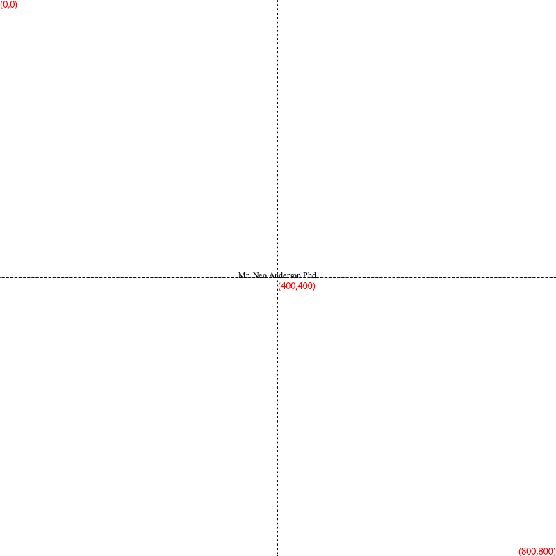
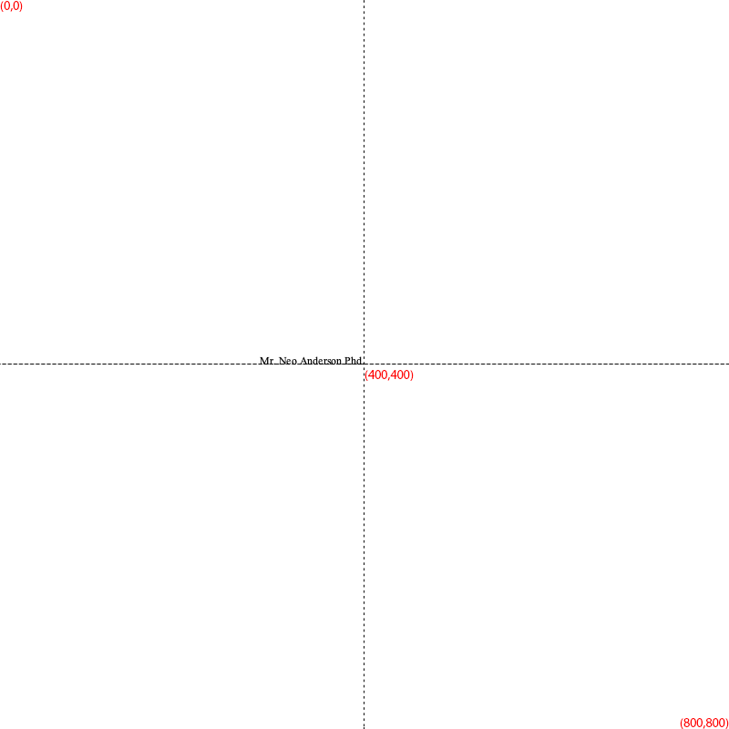
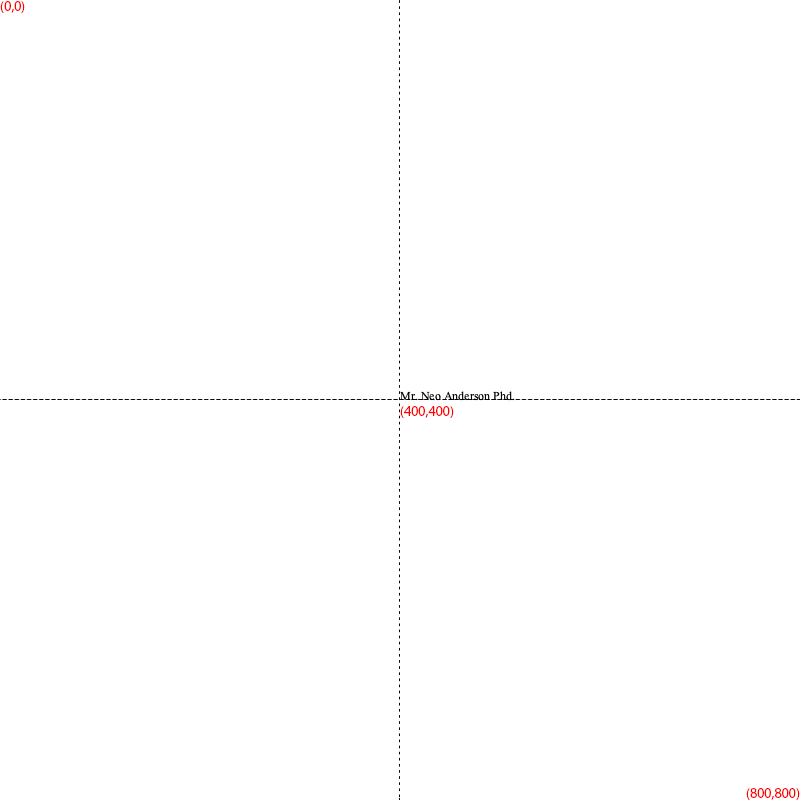

# Examples

This directory contains sample files and commands to demonstrate the usage of BulkTextRenderer, specifically focusing on text alignment.

## Sample Files
- [names.csv](names.csv): A sample CSV file with names.
- [test.png](test.png): A sample template image.

## Alignment Examples

The following commands demonstrate how to render text with different alignments relative to a specific coordinate $(X=400, Y=400)$.

### 1. Center Alignment
Text is centered on the point $(400, 400)$.
```bash
java -jar BulkTextRenderer-1.3-SNAPSHOT.jar --x=400 --y=400 -a center -c ./example/names.csv -t ./example/test.png -o ./example/
```
**Output:**


### 2. Left Alignment
Text is positioned to the **left** of the point $(400, 400)$, meaning the text ends at $X=400$.
```bash
java -jar BulkTextRenderer-1.3-SNAPSHOT.jar --x=400 --y=400 -a left -c ./example/names.csv -t ./example/test.png -o ./example/
```
**Output:**


### 3. Right Alignment
Text is positioned to the **right** of the point $(400, 400)$, meaning the text starts at $X=400$.
```bash
java -jar BulkTextRenderer-1.3-SNAPSHOT.jar --x=400 --y=400 -a right -c ./example/names.csv -t ./example/test.png -o ./example/
```
**Output:**


## Visual Representation
```
LEFT alignment:    [Hello World]X
CENTER alignment:  [Hello X World]
RIGHT alignment:   X[Hello World]
```
*(X marks the coordinate point 400, 400)*
