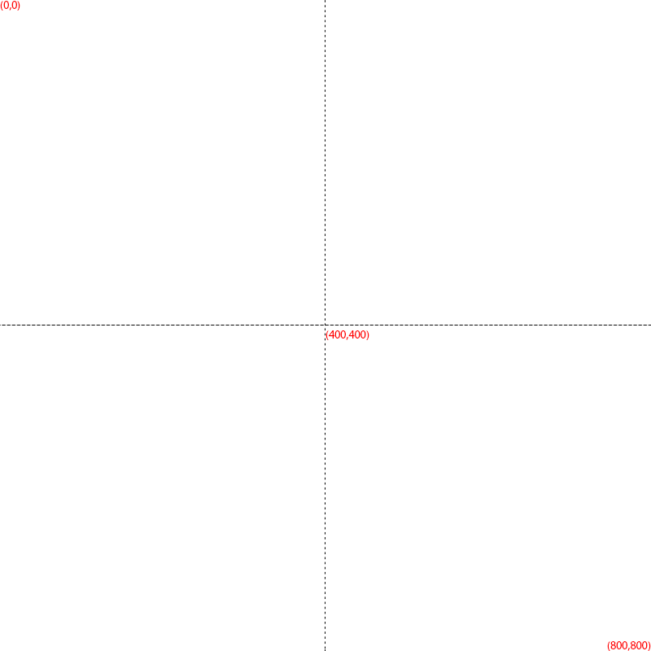

# Examples

Sample inputs and renders produced by BulkTextRenderer, focused on the example data under this folder.

### Sample assets
- `names.csv` – sample CSV with test entries
- `test.png` – PNG template used for image rendering examples
- `template.pdf` – PDF template used to show PDF output
- `test.jpg` – supporting JPEG template (mirrors the PNG layout)

### Output artifacts (example/output)
BulkTextRenderer writes the generated files to `example/output/`. During this investigation we produced:
- `test-Neo_Anderson.png` – PNG output with centered text
- `test-Neo_Anderson.jpg` – JPEG output using the same alignment
- `template-Neo_Anderson.pdf` – PDF output rendered from the sample template

Each file is named according to the entry in `names.csv` and the requested format.

### Alignment refresher
The rendering commands below use $(X=400, Y=400)$ as the anchor point. Set `-a center`, `-a left`, or `-a right` to control how the text aligns relative to that point.

> **Note:** The examples use the font `"Felix Titling"`, which must be installed on your system.

#### Base Template (`test.png`)


#### Alignment Previews
| Left (`-a left`) | Center (`-a center`) | Right (`-a right`) |
| :---: | :---: | :---: |
|  |  |  |

```
LEFT alignment:    [Hello World]X
CENTER alignment:  [Hello X World]
RIGHT alignment:   X[Hello World]
```
*(X marks the anchor point at 400, 400)*

## Render with the native executable
```powershell
cd example
..\build\native\nativeCompile\bulkTextRenderer.exe -f "Felix Titling" --x=400 --y=400 -a center -c names.csv -t test.png -o output/ -s 50
..\build\native\nativeCompile\bulkTextRenderer.exe -f "Felix Titling" --x=400 --y=400 -a center -c names.csv -t test.jpg -o output/ -s 50
..\build\native\nativeCompile\bulkTextRenderer.exe -f "Felix Titling" --x=400 --y=400 -a center -c names.csv -t template.pdf -o output/ -s 50
```
Each run saves a new file under `output/`, visible as `test-Neo_Anderson.png`, `test-Neo_Anderson.jpg`, and `template-Neo_Anderson.pdf`.

## Render with the JAR
```bash
cd example
java -jar ..\build\libs\BulkTextRenderer-<VERSION>.jar -f "Felix Titling" --x=400 --y=400 -a center -c names.csv -t test.png -o output/ -s 50
java -jar ..\build\libs\BulkTextRenderer-<VERSION>.jar -f "Felix Titling" --x=400 --y=400 -a center -c names.csv -t test.jpg -o output/ -s 50
java -jar ..\build\libs\BulkTextRenderer-<VERSION>.jar -f "Felix Titling" --x=400 --y=400 -a center -c names.csv -t template.pdf -o output/ -s 50
```
Use `<VERSION>` to match the JAR you just built (for example `1.3-SNAPSHOT`).
